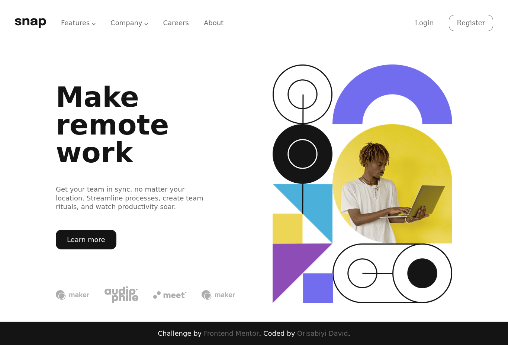

# Overview
## Frontend Mentor - Intro section with dropdown navigation solution

A solution to the [Intro section with dropdown navigation challenge on Frontend Mentor](https://www.frontendmentor.io/challenges/intro-section-with-dropdown-navigation-ryaPetHE5). This solution is implemented with the use of HTML, Vanilla CSS and Vanilla JavaScript.

## Introduction
A challenge that was built from resources gotten from [Frontend Mentor](https://www.frontendmentor.io/challenges/intro-section-with-dropdown-navigation-ryaPetHE5). The features of the challenge are listed below:
 - A dropdown menu on desktop when interacting with navigation link
 - A mobile navigation menu to correspond with responsiveness of the site
 - Couple of hover effects is incorporated into the design
## Challenge Screenshot

The above links to a screenshot of the ahllenge in desktop and mobile view. It can also be found in the design directory.
## Process
Building a project like this open and reminded of quite some tools. In building the web page layour I used flexbox throughout.
I will be putting my thought process in form of a list so to ease reading and understanding.

- At first, I study the design to get an understanding of the entire layout
- To understand the entire layout of the project, I had to breakdown the project to tiny bits detail.
- The project as a two form of layout, the Mobile and Desktop view. I started with the Desktop view
- I find the desktop view of the project easy to build compared to starting with a mobile view.
- I then broke down the details on the desktop version into smaller components:
  - The navigation part, which comprises of three parts(the logo, the nav links and dropdowns, and the call to action button).This part,
    I seperated using a block element like the div so to use flexbox technology easily
  - The next section, I decided to place it in a header element. The header section was then divided into two, a div containing all the text
    and the other div containing the image of that section.
  - As you will see on the webpage, the part of the header containing all the text was managed by also using flexbox, in a more creative which is by using the `flex-direction: column;` property to make them align to a vertical view.
  - This two divs of the header also acquire equal space which was possible by setting `flex: 1;` on both the divs in the header.
  - The footer contains name of the person that develop the page which my name (Orisabiyi David).

  #### Mobile View
  - After building the necessary parts of the desktop and including active and states to the dekstop page I moved on to analyze and build
    the mobile view
  - The mobile tends to be little disturbing, since it needed a menu bar that masks the entire navigation apart from the logo.